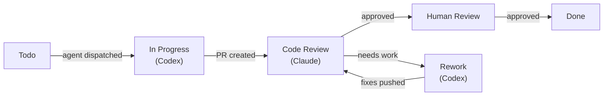
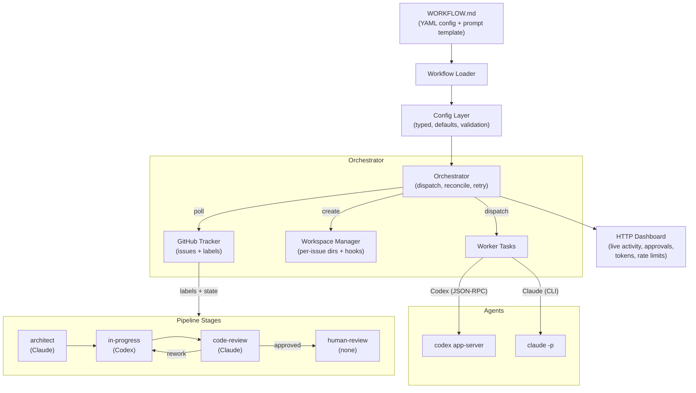
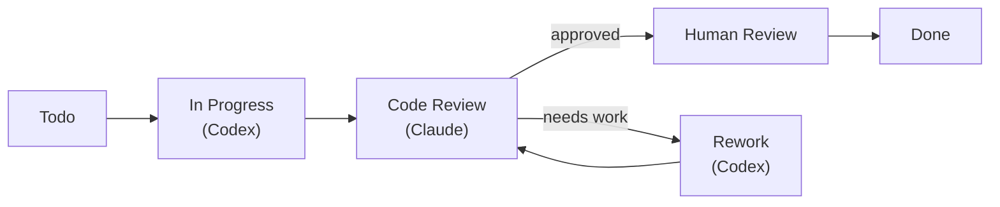
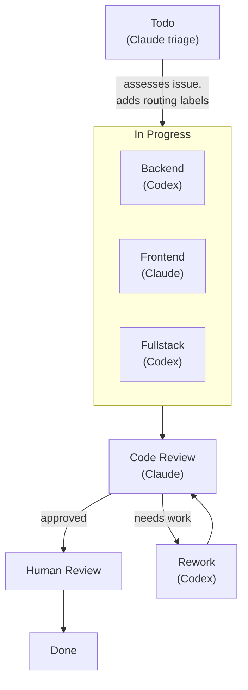

# chronoai-symphony

A multi-agent coding orchestrator built on the [Symphony Service Specification](https://github.com/openai/symphony/blob/main/SPEC.md), extended with multi-agent pipelines, native Claude Code support, and a live operations dashboard.

Symphony turns GitHub Issues into autonomous coding sessions. It polls your repository, dispatches coding agents (OpenAI Codex or Claude Code) to work on issues in isolated workspaces, manages the full lifecycle from implementation through code review to human approval, and provides real-time observability through a web dashboard.

**Key features beyond the Symphony spec:**

- **Multi-agent pipelines** - Different agents for different workflow phases (e.g., Codex implements, Claude reviews)
- **Native Claude Code CLI** - Direct integration with `claude -p`, no third-party wrappers
- **Custom pipeline stages** - Define any workflow state with its own agent, role, and prompt
- **Shared + targeted prompt overlays** - Keep one common prompt body and append per-state or per-role instructions where needed
- **Per-stage prompts** - Each pipeline stage can have its own prompt template
- **Local coordination surface** - Shared notes, per-role mailboxes, and scope claims for parallel-agent handoffs without issue comment spam
- **Live dashboard** - Real-time activity feed, token usage, rate limits, approval queue
- **GitHub App auth** - Bot identity for commits/PRs with auto-refreshing tokens
- **PR review cycle** - Automated code review → human review → rework loop
- **Workflow hardening** - Stage-aware retries, responsive cancellation, and config validation on reload

**Core capabilities:**

- Polls GitHub Issues and dispatches agents based on labels and state
- Creates isolated per-issue workspaces with feature branches
- Runs multiple agents in parallel on different issues
- Manages retries with exponential backoff and stall detection
- Streams agent activity to a web dashboard with approve/deny controls
- Tracks token usage and rate limits across both Codex and Claude
- Hot-reloads valid `WORKFLOW.md` changes without restart

## Agent-Assisted Setup

The fastest way to adopt Symphony is to ask your preferred coding agent to generate a project-specific `WORKFLOW.md` from this README. Use a prompt like this:

```text
Read https://github.com/ChronoAIProject/chronoai-symphony/blob/main/README.md
and create a production-ready WORKFLOW.md for my repository.

Repository: <owner>/<repo>
Tech stack: <your stack>
Default branch: <main or trunk>
Package/test commands: <if known>

Requirements:
- Reuse one shared branch and one shared PR per issue.
- Use one persistent workpad comment per agent role.
- Keep one common prompt body and use `prompt.state_instructions` plus `prompt.role_instructions` for small per-state or per-role deltas.
- Default to full agent permissions and tool access when Symphony runs inside a dedicated trusted environment; only add stricter allowlists or sandboxing if the repo explicitly needs them.
- Include explicit stop conditions so agents do not loop or keep polishing forever.
- Include blocker handoff rules so agents stop cleanly when stuck.
- Keep pipeline roles unique per state.
- If the workflow can run parallel stages, define scopes and tell agents to use Symphony mailbox, note, and claim helpers instead of extra GitHub comments.
- Prefer targeted verification commands for this repo.
- Add repo-specific hooks for clone, checkout, install, and test setup.
- If both Codex and Claude are available, use a sensible implementer/reviewer split.
```

The result should be a tailored `WORKFLOW.md`, not a generic demo prompt.

If you want the agent to start from a close-fit template instead of from scratch, point it at one of these starters first:

- `workflow-templates/WORKFLOW.webapp.md`
- `workflow-templates/WORKFLOW.backend.md`
- `workflow-templates/WORKFLOW.monorepo.md`

## Quick Start

### Prerequisites

- [Rust 1.94+](https://rustup.rs/) (`curl --proto '=https' --tlsv1.2 -sSf https://sh.rustup.rs | sh`)
- [Codex CLI](https://github.com/openai/codex) with `app-server` support (`codex app-server` must work)
- A GitHub repository with issues to process
- A GitHub personal access token (see [Token Permissions](#token-permissions) below)

### 1. Set environment variables

```bash
export GITHUB_TOKEN=ghp_your_token_here
```

### 2. Create a WORKFLOW.md in your project

Copy the included [WORKFLOW.md](WORKFLOW.md) to your project root and edit it:

```bash
# From the chronoai-symphony repo
cp WORKFLOW.md /path/to/your/project/WORKFLOW.md
```

Then update these fields:
- `tracker.project_slug` - your `owner/repo`
- `hooks.after_create` - your git clone URL and build steps
- `hooks.before_run` - your dependency install commands
- The prompt body - your shared contract across all states
- `prompt.state_instructions` / `prompt.role_instructions` - small per-state or per-role deltas such as review-only, implement-only, or rework-only rules

See the [full config reference](#full-workflowmd-reference) below for all available settings.

### 3. Install and run Symphony

Symphony requires `codex` CLI to be installed and configured on the host machine (it launches `codex app-server` as a subprocess). Docker is available for deployment but requires codex to be available inside the container.

**Install from source (recommended):**

```bash
# Clone the repository
git clone https://github.com/ChronoAIProject/chronoai-symphony.git
cd chronoai-symphony

# Install the symphony binary
cargo install --path crates/symphony-cli

# Run (from your project directory where WORKFLOW.md is)
cd /path/to/your/project
symphony ./WORKFLOW.md --port 8080 --pretty-logs

# Dashboard at http://localhost:8080
```

**Run without installing:**

```bash
# From the chronoai-symphony repo directory
cargo run -- /path/to/your/project/WORKFLOW.md --port 8080 --pretty-logs
```

**With Docker (requires codex installed inside the container):**

```bash
# Create a .env file
echo "GITHUB_TOKEN=ghp_your_token_here" > .env

# Start with Docker Compose
docker compose up -d

# View logs
docker compose logs -f
```

> **Note:** The Docker image does not include codex. You need to either mount the codex binary into the container or build a custom image with codex pre-installed. For most setups, running directly on the host with `cargo install` is simpler.

## Setup Guide for Your Project

This section explains how to integrate Symphony into an existing repository so a coding agent can autonomously work on your GitHub issues.

### Step 1: Label your GitHub Issues

Symphony maps issue states using GitHub labels. Create these labels in your repository:

| Label | Purpose | Symphony State |
|-------|---------|---------------|
| `todo` | Issue ready for agent to pick up | Active (dispatched) |
| `in-progress` | Agent is working on it | Active (tracked) |
| `code-review` | PR created, automated review in progress | Active (review agent) |
| `human-review` | Automated review passed, needs human approval | Active (handoff) |
| `rework` | Reviewer requested changes on the PR | Active (agent addresses feedback) |
| `done` | Work is complete | Terminal (workspace cleaned) |
| `cancelled` | Issue abandoned | Terminal (workspace cleaned) |

An open issue with **no workflow label** defaults to state `Todo`.
A **closed** issue defaults to state `Done`.

**Review lifecycle:**



1. Implementation agent finishes and adds `code-review`
2. Review agent (e.g., Claude) reviews the PR, either approves (`human-review`) or requests changes (`rework`)
3. If rework: implementation agent addresses feedback, moves back to `code-review`
4. If approved: human reviews, then adds `done`

### Step 2: Write your WORKFLOW.md

Place a `WORKFLOW.md` file in your project root. It has two parts:

**YAML front matter** (between `---` delimiters) configures the runtime.
**Markdown body** is the prompt template sent to the coding agent for each issue.

#### Starter templates

For most repos, start from the closest template instead of the generic root file:

```bash
# Web application
cp workflow-templates/WORKFLOW.webapp.md /path/to/your/project/WORKFLOW.md

# Backend service
cp workflow-templates/WORKFLOW.backend.md /path/to/your/project/WORKFLOW.md

# Monorepo
cp workflow-templates/WORKFLOW.monorepo.md /path/to/your/project/WORKFLOW.md
```

Template intent:

- `WORKFLOW.webapp.md`: frontend or full-stack product repos where UI quality and targeted route/component verification matter.
- `WORKFLOW.backend.md`: APIs, services, workers, or data-heavy repos where migrations, contracts, and operational safety matter.
- `WORKFLOW.monorepo.md`: multi-package repos where agents need strict workspace scoping and targeted verification to avoid roaming.

#### Minimal WORKFLOW.md

```markdown
---
tracker:
  kind: github
  api_key: $GITHUB_TOKEN
  project_slug: your-org/your-repo
---

Fix issue {{ issue.identifier }}: {{ issue.title }}.

{{ issue.description }}
```

#### Full WORKFLOW.md reference

```yaml
tracker:
  kind: github                          # Required. Only "github" supported.
  project_slug: owner/repo             # Required. GitHub owner/repo.
  endpoint: https://api.github.com     # Optional. Default shown.

  # Auth option 1: Personal access token
  api_key: $GITHUB_TOKEN               # Supports $VAR env references.

  # Auth option 2: GitHub App (commits/PRs show as "app-name[bot]")
  # app_id: $GITHUB_APP_ID             # Supports $VAR env references.
  # installation_id: $GITHUB_APP_INSTALLATION_ID
  # private_key_path: $GITHUB_APP_PRIVATE_KEY_PATH
  active_states:                        # Optional. Default: Todo, In Progress.
    - Todo
    - In Progress
    - Human Review                       # Agent waits; re-dispatched on Rework.
    - Rework                             # Agent reads PR feedback and fixes.
  terminal_states:                      # Optional. Default shown.
    - Done
    - Closed
    - Cancelled
    - Canceled
    - Duplicate

polling:
  interval_ms: 30000                    # Optional. Poll every 30s (default).

workspace:
  root: /tmp/symphony_workspaces       # Optional. Supports ~ and $VAR.

git:
  user_name: symphony-bot              # Git author name for agent commits.
  email: symphony@your-org.com         # Optional. Git author email.

hooks:
  after_create: |                       # Runs once when workspace is first created.
    git clone --depth 1 https://github.com/owner/repo.git .
  before_run: |                         # Runs before each agent attempt.
    git fetch origin
    BRANCH="symphony/issue-${SYMPHONY_ISSUE_NUMBER}"
    if git show-ref --verify --quiet "refs/remotes/origin/$BRANCH"; then
      git checkout "$BRANCH" && git pull origin "$BRANCH"
    elif git show-ref --verify --quiet "refs/heads/$BRANCH"; then
      git checkout "$BRANCH"
    else
      git checkout main && git pull
      git checkout -b "$BRANCH" origin/main
    fi
  after_run: |                          # Runs after each attempt (failures ignored).
    echo "done"
  before_remove: |                      # Runs before workspace deletion (failures ignored).
    echo "cleaning up"
  timeout_ms: 300000                    # Hook timeout. Default: 60s.

agent:
  default: codex                       # Which agent profile to use by default.
  max_concurrent_agents: 10            # Global concurrency limit. Default: 10.
  max_turns: 20                        # Max Symphony-managed outer turns per agent session. Must be > 0.
  max_retry_backoff_ms: 300000         # Max retry delay. Default: 5 minutes.
  auto_merge: false                    # Auto-merge after approval. Default: false.
  require_label: symphony              # Only dispatch issues with this label.
                                        # Prevents public users from triggering runs.
  max_concurrent_agents_by_state:      # Optional per-state concurrency limits.
    in progress: 5
    todo: 3

# Named agent profiles. Add `agent:<name>` label to an issue to override.
agents:
  codex:
    command: codex app-server          # Launch command.
    approval_policy: never             # never, on-request, granular, etc.
    model: gpt-5.3-codex              # Passed as --model flag + env var.
    reasoning_effort: xhigh            # Passed as --config flag + env var.
    network_access: true               # Sandbox network access. Default: true.
    turn_timeout_ms: 3600000           # Turn timeout. Default: 1 hour.
    read_timeout_ms: 30000              # Handshake timeout. Default: 5s.
    stall_timeout_ms: 300000           # Inactivity timeout. Default: 5 min.
  claude:
    agent_type: claude-cli             # Native Claude Code CLI integration.
    command: claude                    # Official CLI, no wrapper needed.
    model: claude-sonnet-4-6           # Passed as --model flag.
    reasoning_effort: high             # Passed as --effort flag. low/medium/high/max.
    approval_policy: never             # Trusted isolated runner default.
    max_turns: 20                      # Claude CLI internal --max-turns per invocation. Default: 20.
    # allowed_tools / disallowed_tools are optional. Leave them unset for full access.
    network_access: true
    turn_timeout_ms: 7200000           # 2 hours for full Claude session.

# Optional: custom pipeline stages (replaces agent.by_state when set)
# pipeline:
#   stages:
#     - state: in-progress               # Stage per state.
#       agent: codex                     # Agent profile name, or "none".
#       role: implementer               # {{ stage.role }} in prompts. Unique per state.
#       transition_to: code-review      # {{ stage.transition_to }}. Must point to a known state.
#     - state: code-review
#       agent: claude
#       role: reviewer
#       prompt: "Custom prompt..."       # Replaces WORKFLOW.md body.
#       transition_to: human-review
#       reject_to: rework               # {{ stage.reject_to }}. Requires transition_to.
#     - state: human-review
#       agent: none                      # No agent dispatched. Handoff state only.

prompt:
  state_instructions:                   # Optional. Appended after the shared body for matching states.
    code-review: |
      Review only. Do not implement feature work in this state.
    rework: |
      Read open review feedback first and fix only the accepted review items.
  role_instructions:                    # Optional. Appended after shared + state instructions for matching roles.
    reviewer: |
      Review diffs, verification, and risk only. Do not author fixes.

server:
  port: 8080                            # Enable HTTP dashboard on this port.
```

### Hook environment variables

Hooks receive these environment variables for the current issue:

| Variable | Example | Description |
|----------|---------|-------------|
| `SYMPHONY_ISSUE_ID` | `#68` | Issue ID |
| `SYMPHONY_ISSUE_IDENTIFIER` | `#68` | Human-readable identifier |
| `SYMPHONY_ISSUE_NUMBER` | `68` | Issue number (without `#`) |

### Step 3: Template variables

The prompt body uses [Liquid](https://shopify.github.io/liquid/) template syntax. These variables are available:

**`issue` object:**

| Variable | Type | Description |
|----------|------|-------------|
| `issue.id` | string | Issue ID (`#123` format) |
| `issue.identifier` | string | `#123` format |
| `issue.title` | string | Issue title |
| `issue.description` | string or nil | Issue body |
| `issue.priority` | integer or nil | From `priority:N` labels |
| `issue.state` | string | Current state (from labels) |
| `issue.url` | string | GitHub issue URL |
| `issue.labels` | array of strings | All labels, lowercase |
| `issue.blocked_by` | array of objects | Each has `.id`, `.identifier`, `.state` |
| `issue.branch_name` | string or nil | Associated branch |
| `issue.created_at` | string | ISO-8601 timestamp |
| `issue.updated_at` | string | ISO-8601 timestamp |

**`attempt`:** `nil` on first run, integer on retry/continuation.

**Example prompt using conditionals:**

```liquid

This is retry attempt {{ attempt }}. Check what was already done and continue.



This is a bug fix. Write a regression test first.



Blocked by {{ blocker.identifier }} ({{ blocker.state }}).

```

### Workflow guardrails

The default `WORKFLOW.md` in this repo is opinionated on purpose. It is designed to reduce the most common failure modes in long-running agent systems:

- One branch per issue, shared across all agents for that issue.
- One PR per issue, reused by implementers and rework agents.
- One persistent workpad comment per agent role, instead of comment spam.
- One local `.symphony/coordination/` scratchpad per workspace for cross-agent handoffs and durable notes.
- Explicit stop conditions so agents hand off after success, blocker discovery, or "no change needed".
- Explicit blocker rules so agents do not retry the same dead end forever.
- Per-state prompt overlays so review, rework, and triage rules can differ without copying the full shared prompt.
- Validation rejects unsafe workflow edits such as duplicate stage roles, unknown stage agents, self-looping transitions, and invalid `agent: none` transitions.

When `WORKFLOW.md` changes at runtime, Symphony validates the new config before applying it. Invalid reloads are rejected and the last good config stays in effect.

### Trusted runner default

The example workflows in this repo assume Symphony runs inside a dedicated trusted environment such as an isolated VM, devcontainer, or CI worker. That is why the default examples are permissive:

- Codex uses `approval_policy: never`. Symphony sends a structured `workspaceWrite` sandbox policy by default with full network access.
- Claude uses `approval_policy: never` and leaves `allowed_tools` / `disallowed_tools` unset so the CLI can use its full tool surface.

If your environment is less trusted, tighten those fields deliberately.

### Parallel agent coordination

When multiple agents work on the same issue, Symphony prepares local coordination files inside the workspace and ignores them via `.git/info/exclude`:

- `.symphony/coordination/shared.md` for durable facts, file ownership, and decisions
- `.symphony/coordination/handoffs.md` for targeted baton-passes such as `To reviewer: ...`
- `.symphony/coordination/roles/<role>.md` for one role's local notes

This is intentionally closer to a scratchpad and mailbox model than to free-form issue-comment chatter. Use the GitHub workpad for the externally visible status record and use the local coordination files for short operational notes between agents.

You do not install these helpers manually. Symphony creates them automatically inside each worker workspace under `.symphony_bin/`, prepends that directory to the agent subprocess `PATH`, and starts an internal localhost coordination API for note, mailbox, and claim operations.

For append-style writes to shared coordination files, prefer the workspace helper:

```bash
symphony-note .symphony/coordination/shared.md "Owned paths: backend/auth and db/migrations"
symphony-note .symphony/coordination/handoffs.md "To reviewer: focus on token refresh and migration ordering"
```

`symphony-note` uses the internal Symphony coordination API when it is available, and otherwise falls back to a workspace lock so two agents do not trample each other while leaving baton-passes.

For structured live coordination, Symphony also provisions mailbox and claim helpers in `.symphony_bin`:

```bash
symphony-mailbox read
symphony-mailbox send reviewer "Focus on token refresh and migration ordering"
symphony-claim list
symphony-claim claim backend/auth "editing token refresh flow"
```

`symphony-note`, `symphony-mailbox`, and `symphony-claim` use the internal Symphony coordination API when it is available, with the old local-file behavior kept only as a fallback path. That makes shared-note appends, active mailbox traffic, and scope claims part of the orchestrator-owned coordination surface instead of just hidden workspace edits.

When the API-backed helper path can resolve the workspace, the helpers also mirror structured coordination audit records into `.symphony/coordination/events.tsv`; otherwise Symphony falls back to direct runtime events. In both cases, mailbox sends, claim acquisitions, and shared-note writes are visible in the activity feed.

Codex sessions also advertise native dynamic coordination tools, `symphony_note`, `symphony_mailbox`, and `symphony_claim`, when Symphony has the internal coordination API and issue context available. Those tools call the same backend as the helper commands, so Codex can coordinate without falling back to shell commands first.

Claude and Codex can coordinate with each other today because both paths hit the same orchestrator-owned backend. A mailbox message sent from Claude through `symphony-mailbox` is visible to Codex through `symphony_mailbox`, and the reverse is true as well.

Why only Codex gets native tools right now: the current Codex integration is a long-lived JSON-RPC app-server session with first-class dynamic tool advertisement, while the current Claude integration is a headless `claude -p` subprocess with CLI tool filters. The orchestration backend is shared across both agents, but only Codex currently has an in-band native tool transport wired up. A future Claude-native path would likely use MCP against the same backend rather than a different coordination store.

Reviewers should treat workflow and coordination misuse as a review concern. If `.symphony/coordination/events.tsv` or the local coordination files show duplicate workpads, duplicate PR attempts, direct edits to another role's notes, committed runtime scratch files, or scope collisions, reject the PR to `rework` and call out the workflow violation explicitly.

### Step 4: Blocker detection

Symphony detects blockers from issue body text. Use these patterns:

```
blocked by #45
depends on #102
Blocked by #12
```

Issues in `Todo` state with non-terminal blockers are held until the blockers resolve.

### Step 5: Configure your CI/hooks

A typical `after_create` hook clones your repo. A `before_run` hook ensures the workspace is up to date:

```yaml
hooks:
  after_create: |
    git clone https://github.com/owner/repo.git .
    npm install  # or pip install, cargo build, etc.
  before_run: |
    git fetch origin
    git checkout main
    git pull
    npm install
```

## Running in Production

### Docker Compose

Create a `.env` file:

```bash
GITHUB_TOKEN=ghp_your_token_here
SYMPHONY_PORT=8080
RUST_LOG=info
```

```bash
docker compose up -d
```

The dashboard is available at `http://localhost:8080`.

### Kubernetes

Apply the manifests in `k8s/`:

```bash
# Update k8s/secret.yaml with your GitHub token
# Update k8s/configmap.yaml with your WORKFLOW.md

kubectl create namespace symphony
kubectl apply -k k8s/
```

See `k8s/` directory for the full set of manifests (Deployment, Service, ConfigMap, Secret, PVC, ServiceAccount).

## HTTP API

When started with `--port` or `server.port` in WORKFLOW.md:

| Endpoint | Method | Description |
|----------|--------|-------------|
| `/` | GET | HTML dashboard with live updates, activity feed, approval queue |
| `/api/v1/state` | GET | Full system state JSON (running, retrying, tokens, approvals) |
| `/api/v1/{identifier}` | GET | Single issue runtime details |
| `/api/v1/refresh` | POST | Trigger immediate poll cycle |
| `/api/v1/approve/{id}` | POST | Approve or deny a pending agent request |

**Example:**

```bash
# System state
curl http://localhost:8080/api/v1/state | jq .

# Specific issue
curl http://localhost:8080/api/v1/%23123 | jq .

# Force immediate poll
curl -X POST http://localhost:8080/api/v1/refresh

# Approve a pending request
curl -X POST http://localhost:8080/api/v1/approve/abc123 \
  -H 'Content-Type: application/json' \
  -d '{"decision": "approve"}'
```

## Architecture



**Crate structure:**

| Crate | Purpose |
|-------|---------|
| `symphony-core` | Domain types, errors, pipeline stages, identifiers |
| `symphony-workflow` | WORKFLOW.md parsing, config, Liquid templates, file watching |
| `symphony-tracker` | `IssueTracker` trait + GitHub Issues adapter + App token auth |
| `symphony-workspace` | Workspace lifecycle, hooks, git identity, path safety |
| `symphony-agent` | Codex JSON-RPC protocol + Claude CLI adapter |
| `symphony-orchestrator` | Poll loop, dispatch, reconciliation, retry, approval queue |
| `symphony-server` | Axum HTTP server with live dashboard + JSON REST API |
| `symphony-logging` | Structured tracing setup |
| `symphony-cli` | CLI entry point |

## Development

### Prerequisites

- Rust 1.94+ (`rustup update stable`)
- Bash (for workspace hooks)
- Git

### Build and test

```bash
cargo build
cargo test
```

### Install

```bash
cargo install --path crates/symphony-cli
```

### Run locally

```bash
export GITHUB_TOKEN=ghp_...

# From source
cargo run -- ./WORKFLOW.md --port 8080 --pretty-logs

# Or after install
symphony ./WORKFLOW.md --port 8080 --pretty-logs
```

### CLI usage

```
symphony [OPTIONS] [WORKFLOW_PATH]

Arguments:
  [WORKFLOW_PATH]  Path to WORKFLOW.md file [default: ./WORKFLOW.md]

Options:
      --port <PORT>  Enable HTTP server on specified port
      --pretty-logs  Use human-readable (non-JSON) log output
  -h, --help         Print help
```

## How It Works

1. **Poll**: Every `polling.interval_ms`, Symphony fetches open GitHub issues matching `active_states` labels.
2. **Dispatch**: Eligible issues are sorted by priority and age, then dispatched up to `max_concurrent_agents`.
3. **Workspace**: Each issue gets a directory under `workspace.root` with its own git clone plus local coordination files under `.symphony/coordination/`.
4. **Branching**: The `before_run` hook creates a feature branch (`symphony/issue-N`) from `main` for each issue, so agents never conflict on the same branch.
5. **Agent**: A Codex app-server subprocess is launched in the workspace. Symphony sends the rendered prompt (including the full issue description) and streams turn events in real-time.
6. **Turns**: The agent can run up to `agent.max_turns` consecutive Symphony-managed turns per session. Between turns, Symphony checks if the issue is still active. For Claude, `agents.claude.max_turns` separately controls the Claude CLI internal `--max-turns` guard for each invocation.
7. **Dashboard**: The web UI shows running sessions with live activity feed, token usage, pending approvals with approve/deny buttons, and retry queue status.
8. **Retry**: On failure, exponential backoff retries are scheduled. On normal exit, a 1-second continuation retry re-checks issue state.
9. **Reconciliation**: Every tick, running issues are checked against GitHub. Terminal issues trigger workspace cleanup. Non-active issues stop the agent.
10. **Reload**: Changes to WORKFLOW.md are detected and applied without restart. Config, prompt, hooks, and concurrency limits update live.

## Supported Agents

Symphony supports two integration modes:

| Agent | Type | Command | Install | Notes |
|-------|------|---------|---------|-------|
| [OpenAI Codex](https://github.com/openai/codex) | `codex` (default) | `codex app-server` | `npm i -g @openai/codex` | JSON-RPC protocol over stdio. Multi-turn sessions managed by Symphony. |
| [Claude Code](https://docs.anthropic.com/en/docs/claude-code) | `claude-cli` | `claude` | [Install guide](https://docs.anthropic.com/en/docs/claude-code/getting-started) | Native CLI integration. Uses `claude -p` with `--output-format stream-json`, `--verbose`, and hook event streaming. Symphony manages outer turns and resumes the same Claude session between invocations. |

### Multi-agent setup

Define multiple agents in `WORKFLOW.md` and assign them per-issue via GitHub labels:

```yaml
agents:
  codex:
    command: codex app-server
    approval_policy: never
    model: gpt-5.3-codex
    reasoning_effort: xhigh           # Codex: -c model_reasoning_effort=xhigh
  claude:
    agent_type: claude-cli
    command: claude
    model: claude-sonnet-4-6
    reasoning_effort: high             # Claude: --effort high (low/medium/high/max)
    approval_policy: never
    max_turns: 20                      # Claude CLI internal --max-turns per invocation

agent:
  default: codex    # Issues without a label use Codex
```

`reasoning_effort` maps to the right flag for each agent:

| Agent | Flag passed |
|-------|-------------|
| Codex | `-c model_reasoning_effort=<value>` |
| Claude Code | `--effort <value>` (low, medium, high, max) |

To use Claude for a specific issue, add the label `agent:claude` to the GitHub issue. Both agents can run in parallel on different issues simultaneously.

### Implement + Review pipeline

Use different agents for different workflow phases. Codex implements, Claude reviews:

```yaml
agents:
  codex:
    command: codex app-server
    approval_policy: never
    model: gpt-5.3-codex
  claude:
    agent_type: claude-cli
    command: claude
    approval_policy: never
    model: claude-sonnet-4-6

agent:
  default: codex
  by_state:
    code-review: claude       # Claude reviews after Codex implements
    rework: codex             # Codex fixes after review feedback
```



The implementation agent moves the issue to `code-review` when done. Symphony automatically switches to the Claude agent for review. Claude reviews the PR and either approves (→ `human-review`) or requests changes (→ `rework`), where Codex picks it up again.

### Custom pipeline stages (advanced)

For full control, use the `pipeline:` section. Each stage defines an agent, role, optional prompt override, and transitions. This replaces `agent.by_state`:

```yaml
pipeline:
  stages:
    - state: architect                    # Custom state - any name
      agent: claude
      role: architect
      prompt: |                           # Custom prompt REPLACES the WORKFLOW.md body
        You are a software architect. Analyze {{ issue.identifier }}.
        Create an implementation plan. Do NOT write code.
        {{ issue.description }}
      transition_to: in-progress

    - state: in-progress
      agent: codex
      role: implementer                   # Available as {{ stage.role }} in the prompt
      transition_to: code-review

    - state: code-review
      agent: claude
      role: reviewer
      prompt: |                           # Different prompt for review phase
        Review PR for {{ issue.identifier }}: `gh pr diff`
        If good: add label `human-review`. If not: add label `rework`.
      transition_to: human-review
      reject_to: rework

    - state: rework
      agent: codex
      role: implementer
      transition_to: code-review

    - state: human-review
      agent: none                         # No agent - handoff to human
```

Guardrails for custom pipelines:

- Keep `role` unique within a state. Symphony uses `issue-id:role` internally to prevent duplicate dispatch.
- Do not use `:` inside a role name.
- `reject_to` should only be used on stages that also declare `transition_to`.
- `transition_to` and `reject_to` should point to known active, terminal, or pipeline states.
- `agent: none` means handoff only. It should not declare automated transitions.
- If multiple runnable stages share the same state, each one must define a unique non-root `scope`.
- If multiple runnable stages share the same state, they must use the same `transition_to` and the same `reject_to` target so the next state is not ambiguous.

**Prompt behavior:**

| Stage config | What happens |
|---|---|
| `prompt.state_instructions.<state>` | Appends extra instructions after the shared `WORKFLOW.md` body for that state. Use this for small state deltas. |
| `prompt.role_instructions.<role>` | Appends extra instructions after the shared body and state instructions for that role. Use this for review-only vs implement-only deltas. |
| No `prompt` field | Uses the WORKFLOW.md body with `{{ stage.role }}`, `{{ stage.transition_to }}`, `{{ stage.reject_to }}` injected |
| Has `prompt` field | Stage prompt **replaces** the WORKFLOW.md body. Use `{{ default_prompt }}` to include the original body |

Use the prompt layers this way:

- `WORKFLOW.md` body: rules that every agent and every backend should follow.
- `prompt.state_instructions`: small state-specific deltas such as "review only" or "fix only review feedback".
- `prompt.role_instructions`: small role-specific deltas such as "review only", "implement only", or "do not author fixes".
- `pipeline.stages[].prompt`: full replacement for unusual stages such as architecture, security review, or repo-specific release handling.

`prompt.state_instructions` applies to both legacy `agent.by_state` workflows and custom `pipeline` workflows because it keys off the current issue state, not the selected backend. `prompt.role_instructions` applies when a pipeline stage role is active.

**Template variables available in all prompts:**

| Variable | Description |
|---|---|
| `{{ stage.role }}` | Role label (e.g., "implementer", "reviewer", "architect") |
| `{{ stage.transition_to }}` | Next state on success |
| `{{ stage.reject_to }}` | Next state on rejection |
| `{{ default_prompt }}` | The rendered WORKFLOW.md body (only in stage prompt overrides) |

### Parallel agents and conditional stages

Multiple stages can share the same state. Use `when_labels` to activate stages conditionally based on issue labels, and `scope` to tell each agent where to focus:

```yaml
pipeline:
  stages:
    # Triage: Claude assesses the issue, plans if complex, adds routing labels
    - state: todo
      agent: claude
      role: triage
      prompt: |
        Assess {{ issue.identifier }}. Determine affected areas.
        Add exactly one routing combination:
        - `backend` only, `frontend` only, both for parallel, or `fullstack` for cross-cutting.
        If complex: create an implementation plan.
        Move to in-progress.
      transition_to: in-progress

    # Parallel: both run simultaneously when triage adds both labels
    - state: in-progress
      agent: codex
      role: backend-dev
      when_labels: [backend]
      scope: backend/
      transition_to: code-review

    - state: in-progress
      agent: claude
      role: frontend-dev
      when_labels: [frontend]
      scope: frontend/
      transition_to: code-review

    # Fullstack: triage adds "fullstack" label for cross-cutting work
    - state: in-progress
      agent: codex
      role: implementer
      when_labels: [fullstack]
      scope: src/
      transition_to: code-review
```

**How it works:**



| Triage result | What happens |
|---|---|
| Adds `backend` + `frontend` | Both agents run **in parallel**, each scoped to their directory |
| Adds `backend` only | Only the backend stage runs |
| Adds `frontend` only | Only the frontend stage runs |
| Adds `fullstack` | The fullstack agent runs (cross-cutting work) |
| Complex issue | Triage creates architecture plan in workpad before moving to in-progress |

**Key points:**
- The **triage agent** (Claude on `todo`) is the smart router. It reads the issue, assesses complexity, creates plans for complex work, and adds routing labels. No manual label management needed.
- `when_labels` are user-defined GitHub labels. Any label name works. Every parallel stage must have `when_labels` and a non-root `scope`.
- `scope` is appended to the prompt: "Focus your changes on the `backend/` directory."
- Parallel workers also get local coordination files under `.symphony/coordination/` so they can exchange durable notes without rewriting each other's workpads.
- Each parallel worker gets its own session, activity feed, and token tracking in the dashboard.

**Key differences between agent types:**

| | Codex (`codex`) | Claude Code (`claude-cli`) |
|---|---|---|
| Protocol | JSON-RPC over stdio | `claude -p` with stream-json output |
| Handshake | initialize -> thread/start -> turn/start | None per CLI invocation; Symphony supplies/resumes a stable Claude session ID |
| Turn management | Symphony manages multi-turn loop via `agent.max_turns` | Symphony manages outer turns via `agent.max_turns`; Claude CLI manages its internal tool/model loop within each invocation via `agents.claude.max_turns` |
| Approval policy | Sent in JSON-RPC handshake params | `never` → `--dangerously-skip-permissions` |
| Coordination surface | Native Symphony dynamic tools when available | Same Symphony backend via workspace helpers today |
| Tool filters | Access is managed by Codex sandbox/approval policy | `allowed_tools` / `disallowed_tools` map to Claude CLI flags when you choose to restrict it |
| Prompt delivery | JSON-RPC `turn/start` message | `SYMPHONY_PROMPT_FILE` read by `claude -p` |
| Model flag | `-c model=<value>` | `--model <value>` |
| Reasoning effort | `-c model_reasoning_effort=<value>` | `--effort <value>` (low/medium/high/max) |

## Integrations

### Agent memory with mempalace

[mempalace](https://github.com/milla-jovovich/mempalace) is an optional integration that gives agents persistent, searchable memory across sessions. Without it, each agent session starts with no knowledge of what previous sessions decided, tried, or learned. With mempalace, agents can recall past decisions, patterns, and context from earlier issues in the same project.

**Key design: one palace per project, not per workspace.** Symphony creates a separate workspace directory for every issue, and cleans them up when the issue reaches a terminal state. The mempalace palace lives outside the workspace tree at a shared location (default `~/.mempalace/`) so that all issue workspaces read from and write to the same project memory. Initialization and mining happen once; the palace accumulates knowledge over time.

```text
~/.mempalace/  (persistent, shared across all issues)
  palace data: wings, rooms, knowledge graph

/tmp/symphony_workspaces/
  _42/  ──reads/writes──►  shared palace
  _43/  ──reads/writes──►  shared palace
  _44/  ──reads/writes──►  shared palace
```

**Prerequisites:**

```bash
pip install mempalace
```

> **PATH note:** `pip install mempalace` registers a console script, but on many systems (especially macOS) the binary lands outside `$PATH` (e.g. `/Library/Frameworks/Python.framework/.../bin/`). Use `python3 -m mempalace` in hooks and scripts to bypass the PATH issue entirely. All examples below use this pattern.

**Shared across all agents.** Memory is not per-agent or per-agent-type. When the Codex implementer stores a decision on issue #42, the Claude reviewer on the same issue can read it, and the Codex implementer on issue #43 can find it later. The palace is the shared substrate -- all agents contribute to and read from the same store.

**Hook configuration:**

Three hooks wire up the full read/write cycle. `after_create` mines the project once. `before_run` loads relevant memories for the current issue so every agent starts with context. `after_run` stores coordination artifacts back so the next agent inherits what this session decided.

```yaml
hooks:
  after_create: |
    git clone --depth 1 https://github.com/your-org/your-repo.git .

    # mempalace: mine project into shared palace (one-time, skipped on later issues)
    MP="python3 -m mempalace"
    SLUG="$(git remote get-url origin 2>/dev/null | sed 's|.*github.com[:/]||;s|\.git$||')"
    if [ -n "$SLUG" ]; then
      MARKER="$HOME/.mempalace/.mined_$(echo "$SLUG" | tr '/' '-')"
      if [ ! -f "$MARKER" ]; then
        $MP init 2>/dev/null || true
        $MP mine . --mode projects 2>/dev/null || true
        touch "$MARKER"
      fi
    fi

  before_run: |
    git fetch origin
    # ... branch checkout logic ...

    # mempalace: load wake-up context (L0+L1) and issue-relevant memories.
    MP="python3 -m mempalace"
    mkdir -p .symphony
    $MP wake-up > .symphony/mempalace_wakeup.md 2>/dev/null || true
    $MP search "issue ${SYMPHONY_ISSUE_NUMBER}" --limit 10 \
      > .symphony/mempalace_context.md 2>/dev/null || true

    # Register MCP server so Claude Code gets interactive search/store via 19 tools.
    if command -v claude >/dev/null 2>&1; then
      claude mcp add --scope local mempalace -- python3 -m mempalace.mcp_server 2>/dev/null || true
    fi

  after_run: |
    # mempalace: store coordination artifacts back into shared palace so the
    # next agent (any type, any issue) can find what this session decided.
    MP="python3 -m mempalace"
    if [ -d .symphony/coordination ]; then
      $MP mine .symphony/coordination --mode general 2>/dev/null || true
    fi
```

Then add a MemPalace section to your prompt template so agents know to read context files and use MCP tools:

```liquid
## MemPalace — Cross-Session Memory

**At session start:**
1. Read `.symphony/mempalace_wakeup.md` if it exists — identity and critical facts (L0+L1).
2. Read `.symphony/mempalace_context.md` if it exists — memories relevant to this issue.

**During work:** Before making decisions, search memory first via `mempalace_search` or
`mempalace_kg_query`. Do not guess — verify against memory.

**At session end:** Store decisions and findings for future agents via `mempalace_diary_write`
(role-specific) or `mempalace_kg_add` (entity relationships).
```

Agents need explicit instructions to use mempalace — having the MCP server connected alone is not enough. Without the prompt section above, agents acknowledge tools exist but never invoke them.

**How the memory flows between agents:**

```text
  after_create (once)            before_run (each session)         after_run (each session)
 ┌──────────────────┐          ┌────────────────────────┐        ┌───────────────────────┐
 │ mine project     │          │ wake-up → L0+L1 file   │        │ mine coordination/    │
 │ into palace      │──────►   │ search → context file  │        │ back into palace      │
 └──────────────────┘          │ (all agents read both) │        └───────────┬───────────┘
                               │                        │                    │
                               │ + MCP for Claude       │                    │
                               │   (19 tools: search,   │                    │
                               │    diary, kg, etc.)     │                    │
                               └────────────────────────┘                    │
                                          │                                  │
                                          ▼                                  │
                                ┌──────────────────┐                         │
                                │   Agent session   │                        │
                                │ (Codex, Claude,   │────────────────────────┘
                                │  or any future)   │
                                └──────────────────┘
```

| Hook | What it does | Who benefits |
|------|-------------|-------------|
| `after_create` | Mines project code/docs into palace once | All future agents on this project |
| `before_run` wake-up | Generates L0+L1 identity/facts into `.symphony/mempalace_wakeup.md` (~170 tokens) | Every agent (stable context about project and team) |
| `before_run` search | Loads issue-relevant memories into `.symphony/mempalace_context.md` | Every agent (Codex, Claude, any agent that reads files) |
| `before_run` MCP | Registers mempalace MCP server (19 tools) for Claude | Claude Code (interactive search/store/diary/kg during session) |
| `after_run` | Mines `.symphony/coordination/` artifacts back into palace | All future agents (inherits decisions, handoffs, findings) |

**How the marker file works:**

The first `after_create` invocation derives a project slug from the git remote (`your-org/your-repo`), mines the repo into the palace, and writes `~/.mempalace/.mined_your-org-your-repo`. Subsequent workspaces for the same project see the marker and skip mining entirely. To re-mine after major repo changes, delete the marker file. If the remote URL does not match (non-GitHub hosts), adjust the `sed` pattern or set `SLUG` directly.

**Relationship to Symphony coordination:**

Symphony's built-in coordination (notes, mailbox, claims) is for the current session: this issue, these agents, right now. mempalace adds cross-session memory: what happened on previous issues, what patterns keep recurring, what architectural decisions were made and why. The `after_run` hook bridges the two by mining coordination artifacts into the palace after each session.

| Symphony coordination | mempalace |
|----------------------|-----------|
| `symphony_note` -- ephemeral, per-issue | Persistent, cross-issue, searchable |
| `symphony_mailbox` -- real-time role-to-role | Historical knowledge graph with temporal queries |
| `symphony_claim` -- scope ownership this session | Project-level decision memory across sessions |
| Cleaned up when workspace is removed | Survives workspace cleanup, accumulates over time |

## Authentication

Symphony supports two authentication methods. Both are used by Symphony (for polling) and by the coding agent (for pushing code, creating PRs, updating labels).

### Option 1: Personal Access Token (simple)

Use a fine-grained PAT with these permissions on the target repo:

| Permission | Access | Why |
|------------|--------|-----|
| **Metadata** | Read | Always required |
| **Issues** | Read & Write | Poll issues, update labels, post comments |
| **Contents** | Read & Write | Clone repo, push branches |
| **Pull requests** | Read & Write | Create and update PRs |

```bash
export GITHUB_TOKEN=github_pat_...
```

```yaml
# WORKFLOW.md
tracker:
  api_key: $GITHUB_TOKEN
```

All actions appear under your personal GitHub account.

### Option 2: GitHub App (recommended)

Actions appear as `your-app-name[bot]` with a bot badge. No spare email needed.

**Setup:**

1. Go to **Settings > Developer settings > GitHub Apps > New GitHub App**
2. Name it (e.g., `my-symphony-bot`)
3. Set permissions: Issues (R/W), Contents (R/W), Pull Requests (R/W), Metadata (R)
4. Generate a private key (downloads a `.pem` file)
5. Install the app on your repository
6. Note the **installation ID** from the URL: `github.com/settings/installations/{id}`

```bash
export GITHUB_APP_ID=123456
export GITHUB_APP_INSTALLATION_ID=789012
export GITHUB_APP_PRIVATE_KEY_PATH=/path/to/app.pem
```

```yaml
# WORKFLOW.md (safe to commit - no secrets)
tracker:
  app_id: $GITHUB_APP_ID
  installation_id: $GITHUB_APP_INSTALLATION_ID
  private_key_path: $GITHUB_APP_PRIVATE_KEY_PATH
```

Symphony automatically:
- Generates JWT from the private key
- Exchanges it for a 1-hour installation token
- Refreshes the token every 30 minutes
- Sets `GH_TOKEN` and `GITHUB_TOKEN` for the agent subprocess

## Security

- **Public repo protection:** Set `agent.require_label: symphony` so only issues with that label are dispatched. Public users can create issues but cannot add labels (only collaborators can).
- Workspace paths are sanitized and validated to stay within the configured root
- API tokens are resolved from environment variables, never stored in config files
- Secrets are not logged
- Hooks run inside workspace directories only
- The HTTP server binds to `0.0.0.0` (use firewall rules to restrict access)
- GitHub App tokens auto-refresh and are short-lived (1 hour)

## Acknowledgments

This project is an independent Rust implementation built from the
[Symphony Service Specification](https://github.com/openai/symphony/blob/main/SPEC.md)
created by [OpenAI](https://github.com/openai/symphony). No source code was
copied from the original Elixir reference implementation. The dashboard UI
design was inspired by their Phoenix LiveView dashboard.

The original OpenAI Symphony project is licensed under the
[Apache License 2.0](https://www.apache.org/licenses/LICENSE-2.0).

## License

MIT
